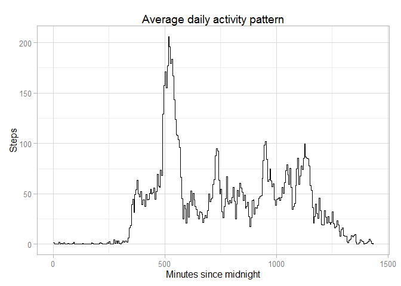
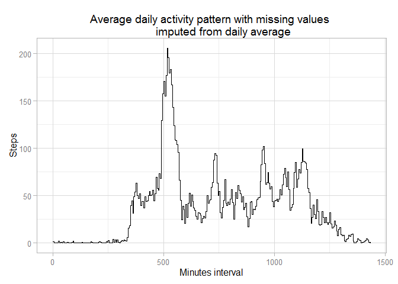

# Reproducible Research: Peer Assessment 1

It is now possible to collect a large amount of data about personal
movement using activity monitoring devices such as a
[Fitbit](http://www.fitbit.com), [Nike
Fuelband](http://www.nike.com/us/en_us/c/nikeplus-fuelband), or
[Jawbone Up](https://jawbone.com/up). These type of devices are part of
the "quantified self" movement -- a group of enthusiasts who take
measurements about themselves regularly to improve their health, to
find patterns in their behavior, or because they are tech geeks. But
these data remain under-utilized both because the raw data are hard to
obtain and there is a lack of statistical methods and software for
processing and interpreting the data.

## Loading and preprocessing the data
This assignment makes use of data from a personal activity monitoring
device. This device collects data at 5 minute intervals through out the
day. The data consists of two months of data from an anonymous
individual collected during the months of October and November, 2012
and include the number of steps taken in 5 minute intervals each day.

We begin by reading the data and appropriately transforming it into a suitable
format for easy analysis.


```r
library(stringr) # for str_pad() function

# Data originated at
# https://d396qusza40orc.cloudfront.net/repdata%2Fdata%2Factivity.zip
filename <- unzip("activity.zip")

activity <- read.csv(file=filename, header=TRUE, stringsAsFactors=FALSE,
                     colClasses=c("integer", "Date", "character"))

activity$interval <- str_pad(activity$interval, width=4, pad="0")
activity$hours <- as.integer(substr(activity$interval, 1, 2))
activity$minutes <- as.integer(substr(activity$interval, 3, 4))
activity$interval <- activity$hours*60 + activity$minutes 
```

One rather unusual attribute of the interval variable is that it represents a
24 hour clock time, despite being represented as an integer. Thus the number 
`5` represents 12:05am, the number `300` represents 3:00am, etc. For this 
reason we pad it out and convert it to minutes from midnight.

## What is mean total number of steps taken per day?
It is interesting to evaluate the average number of steps the analyzed individual
took during the course of the day. 

```r
activity.perday <- aggregate(steps ~ date, data=activity, sum)
mean.perday     <- mean(activity.perday$steps)
median.perday   <- median(activity.perday$steps)
```
We find that the mean number of steps taken per day is 1.0766 &times; 10<sup>4</sup> and 
the median is 10765. To summarize:

```r
summary(activity.perday$steps)
```

```
##    Min. 1st Qu.  Median    Mean 3rd Qu.    Max. 
##      41    8840   10800   10800   13300   21200
```
A simple histogram of steps per day is presented below.


```r
library(ggplot2)
ggplot(activity.perday, aes(x=date, y=steps)) + 
   geom_bar(stat="identity") + 
   labs(title="Histogram of steps per day", 
        x="Date", y="Steps") + 
   theme_light() # new in ggplot2 1.0
```

 


## What is the average daily activity pattern?
The chart below shows the activity pattern on a typical day, calculated based on taking the mean activity for each interval across all days measured:

```r
activity.average <- aggregate(steps ~ interval, data=activity, mean)

ggplot(activity.average, aes(x=interval, y=steps)) + 
   geom_step(stat="identity") + 
   labs(title="Average daily activity pattern", 
        x="Minutes since midnight", y="Steps") + 
   theme_light() # new in ggplot2 1.0
```

 


```r
max.interval.index <- which(activity.average$steps == max(activity.average$steps))
max.interval <- activity.average$interval[max.interval.index]
max.interval.asTime <- format(as.POSIXct('1900-1-1') + max.interval * 60, '%I:%M%p')
```
The interval with the maximum number of steps was the five minute period beginning at 08:35AM.

## Imputing missing values
There are 2304 rows with missing values in the source data; however, we can impute them from the existing data. 

We choose for this example to use the mean from `activity.average` to fill in the blank values. 


```r
missing.activity.index <- which(is.na(activity$steps))
missing.activity.intervals <- activity$interval[missing.activity.index]

for(idx in missing.activity.index)
   {
      ivl <- activity$interval[idx]
      steps <- activity.average[activity.average$interval==ivl,]$steps
      activity[idx,]$steps <- steps
   }
```

As a result of this, there are now 0 rows with missing values. We can see how this affects the plot presented previously:

```r
activity.average.imputed <- aggregate(steps ~ interval, data=activity, mean)

ggplot(activity.average.imputed, aes(x=interval, y=steps)) + 
   geom_step(stat="identity") + 
   labs(title="Average daily activity pattern with missing values imputed from daily average", 
        x="Minutes interval", y="Steps") + 
   theme_light()
```

 

Recalculating the average day with these additional rows:

```r
activity.perday.imputed <- aggregate(steps ~ date, data=activity, sum)

mean.perday.imputed     <- mean(activity.perday.imputed$steps)
median.perday.imputed   <- median(activity.perday.imputed$steps)
```
We find now that the mean number of steps taken per day is 1.0766 &times; 10<sup>4</sup> and the median is 
1.0766 &times; 10<sup>4</sup>.

## Are there differences in activity patterns between weekdays and weekends?
We are interested to compare differences in activity between weekdays and weekends. First we must fortify the data with an extra variable that indicates whether a given day is a weekday or not.

```r
activity$isWeekend <- weekdays(activity$date) %in% c("Saturday", "Sunday")
```

Now we can show the difference between weekdays and weekends in the following panel plot:

```r
activity.average.weekday <- aggregate(steps ~ interval + isWeekend, data=activity, mean)
ggplot(activity.average.weekday, aes(x=interval, y=steps)) + 
   geom_point(stat="sum") + 
   labs(title="Average daily activity pattern, comparing weekdays and weekends", 
        x="Minutes interval", y="Steps") + 
   facet_wrap(~ isWeekend, ncol=2) +
   geom_smooth(method=loess, span=0.2) +
   theme_light()
```

 
